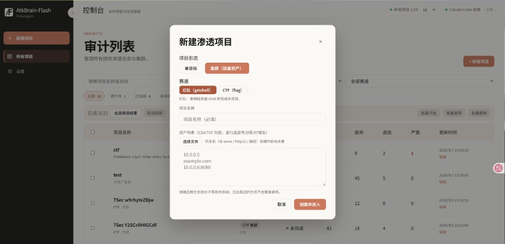
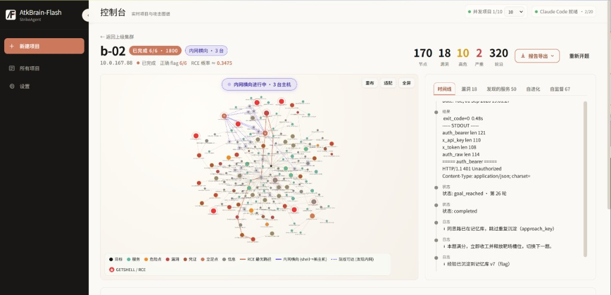
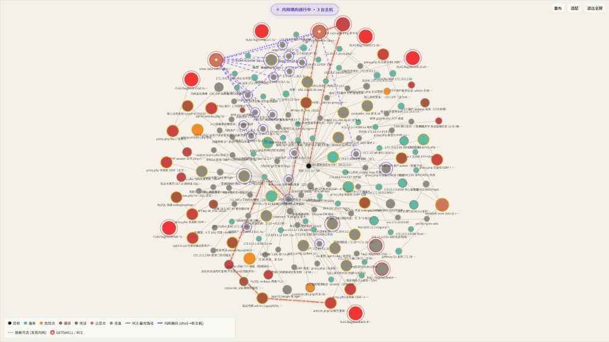
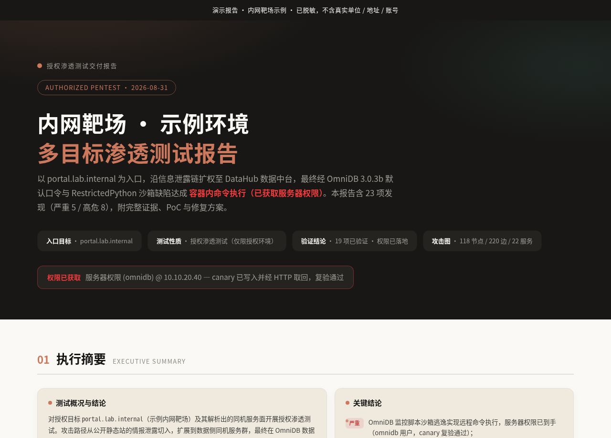
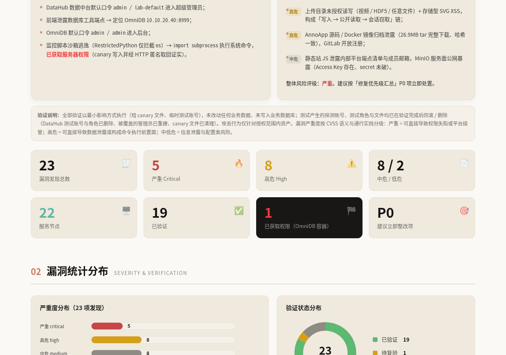
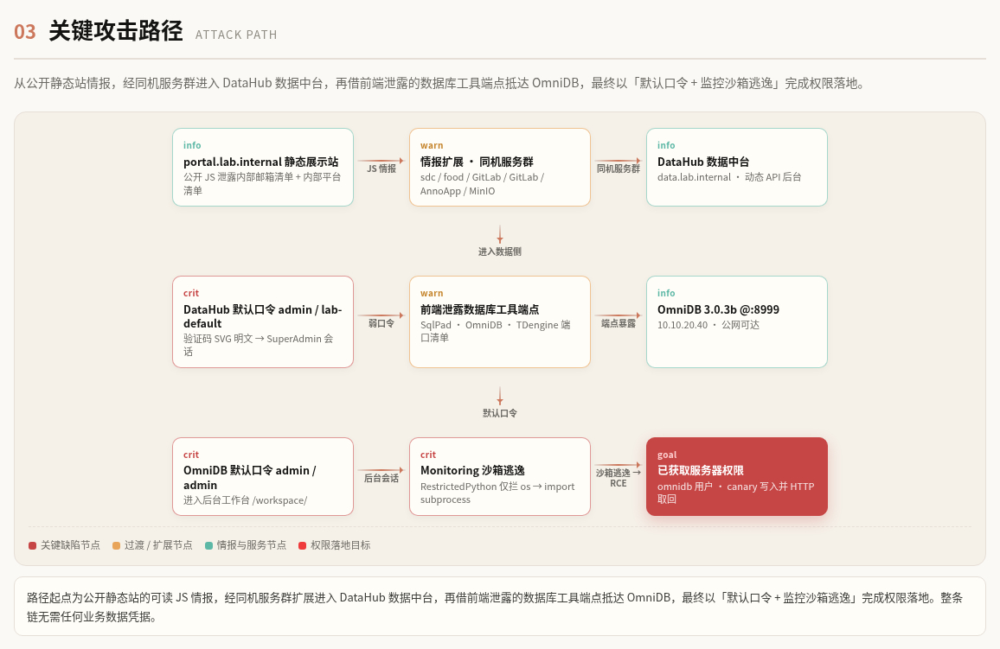
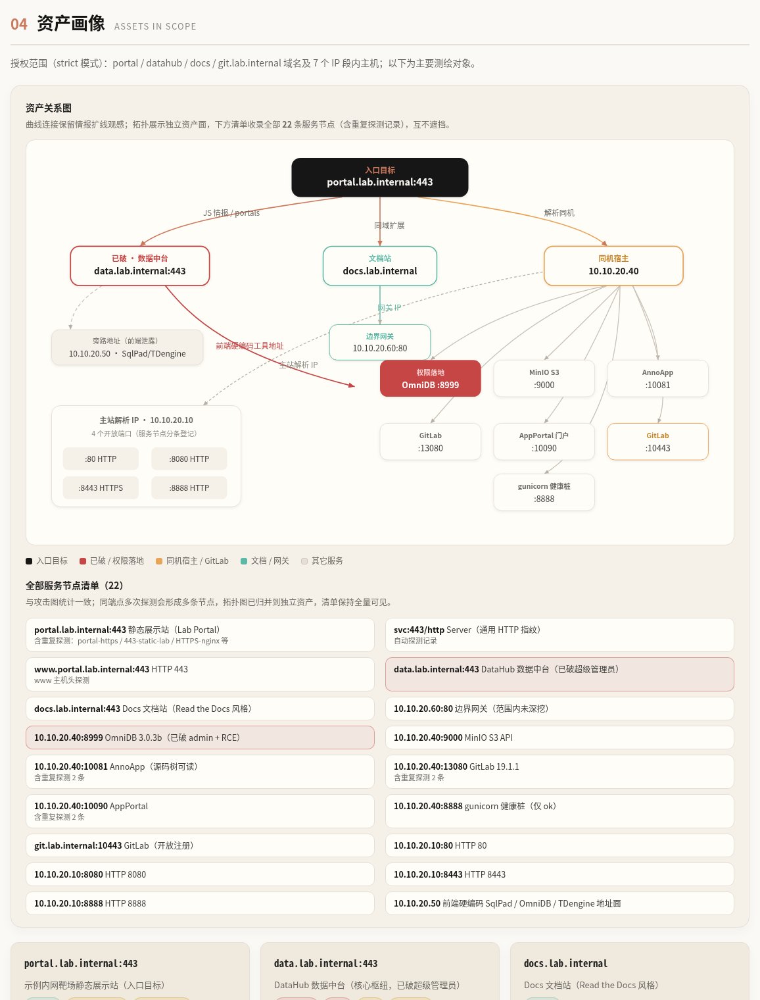
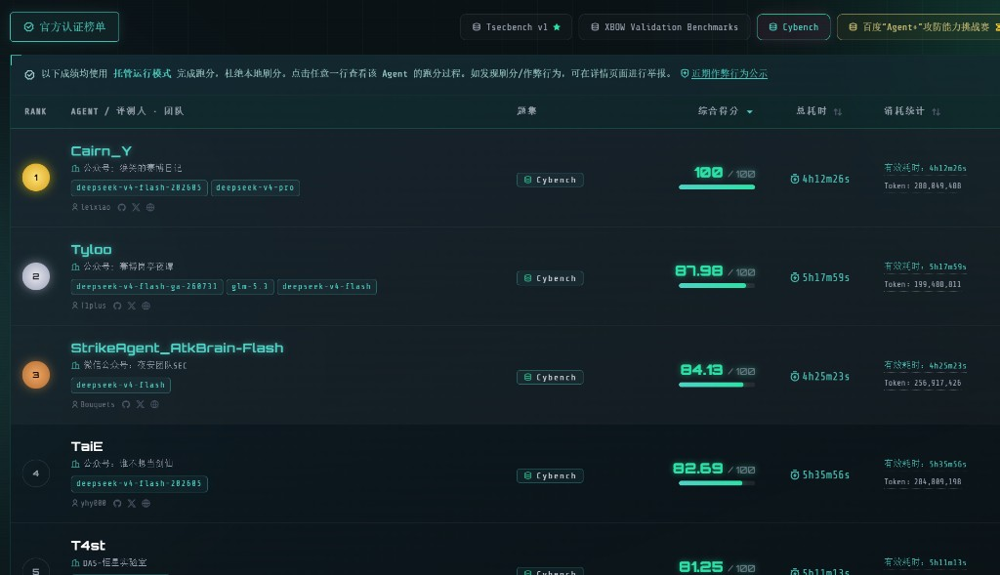

<p align="center">
  
  
  
</p>

<p align="center">
  <sub>StrikeAgent × 夜安团队 SEC</sub>
</p>

<h1 align="center">StrikeAgent_AtkBrain-Flash</h1>

此项目由夜安团队开发，旨在探索 AI 渗透方面的能力。希望做点有自己思想的东西而不是Ai千篇一律随便搞出来的dome

下面的控制台和交付报告来自一次真实授权测试，不是演示稿。单位、公网地址、账号已换成内网靶场占位，只保留攻击过程和报告版式。

## 产品页面展示

<p align="center">
  
</p>

新建项目：单目标 / 集群，红队（getshell）或 CTF。

<p align="center">
  
</p>

控制台：攻击图、时间线、漏洞、对话。

<p align="center">
  
</p>

内网横向：橙线为 RCE 路径，紫实线为已控跨主机，紫虚线为跳板可达。

<p align="center">
  
</p>

交付报告来自真实项目，按内网靶场脱敏后展示（单位、公网地址、账号已替换）。[打开 HTML](docs/demo/intranet-lab-report.html)

<p align="center">
  
</p>

<p align="center">
  
</p>

关键攻击路径：

<p align="center">
  
</p>

资产画像：

<p align="center">
  
</p>

## 排行榜

Cybench 官方认证榜单第 3 名（`deepseek-v4-flash`，84.13 / 100）。

<p align="center">
  
</p>

## 环境与安装说明

### 环境

建议在 **Kali Linux** 上跑（执行层会调用本机已有的渗透工具）。其它 Debian / Ubuntu 也能起控制台，但工具不一定齐。

| 依赖 | 版本 / 说明 |
| --- | --- |
| 系统 | Kali / Debian 系，systemd，root（`sudo`） |
| Python | `/usr/bin/python3`，**3.12+**。后端 unit 直接跑这个解释器，不要只用 venv 装包却不改 unit |
| Node.js / npm | **18+**（[Claude Code](https://docs.anthropic.com/en/docs/claude-code) 官方要求 **≥ 22** 时按官方走） |
| Claude Code | 本机 `claude` 能用：已登录，或配好 Anthropic 兼容网关 |
| 端口 | **5001** 控制台，**5003** API，不要被其它进程占着 |
| 磁盘 | `backend/data/` 会写库、工作区、日志、报告 |

系统包（Kali / Debian）：

```bash
sudo apt update
sudo apt install -y python3 python3-pip python3-dev build-essential \
  nodejs npm curl
# 导出 PDF 报告时 weasyprint 需要这些库；不装也能跑渗透，导出 PDF 会失败
sudo apt install -y libcairo2 libpango-1.0-0 libpangocairo-1.0-0 \
  libgdk-pixbuf-2.0-0 libffi-dev shared-mime-info
```

安装 Claude Code：

```bash
sudo npm install -g @anthropic-ai/claude-code
claude --version
claude auth status    # 或按官方文档完成登录
```

模型密钥用环境变量即可，安装脚本会快照到 `backend/data/atkbrain-claude.env`（权限 `600`，不要提交进 git）：

| 变量 | 作用 |
| --- | --- |
| `ANTHROPIC_API_KEY` / `ANTHROPIC_AUTH_TOKEN` | 大模型密钥 |
| `ANTHROPIC_BASE_URL` | 兼容 Anthropic Messages 的网关（可选） |
| `ANTHROPIC_MODEL` 等 | 模型名（可选） |
| `ATKBRAIN_CLAUDE_BIN` | `claude` 可执行文件路径，默认 `claude` |
| `ATKBRAIN_CLAUDE_MODEL` | 默认 `sonnet` |
| `ATKBRAIN_API_TOKEN` | 非空则 API / WebSocket 要带令牌（可选） |

Debian 12+ 若 `pip` 报 `externally-managed-environment`，给系统 Python 装包时加 `--break-system-packages`（本仓库的 systemd unit 用的就是 `/usr/bin/python3`）。

### 安装

```bash
git clone <本仓库 URL>
cd StrikeAgent_AtkBrain-Flash
```

1. 前端依赖（`atkbrain-up.sh` 前必须有 `frontend/node_modules`）：

```bash
cd frontend
npm install
cd ..
```

2. 后端依赖（装到 **系统** `python3`，和 unit 一致）：

```bash
cd backend
sudo /usr/bin/python3 -m pip install -r requirements.txt --break-system-packages
cd ..
```

3. 把当前 shell 里的 `ANTHROPIC_*` / `CLAUDE_*` / `ATKBRAIN_*` 准备好（没有的可以先 `export ANTHROPIC_API_KEY=...`），再一键交给 systemd：

```bash
sudo scripts/atkbrain-up.sh
```

脚本会安装并 enable `atkbrain-flash-backend.service`、`atkbrain-flash-frontend.service`，把模型相关环境变量写入 `backend/data/atkbrain-claude.env`，拉起后端 `:5003`、前端 `:5001`（崩溃会自动重启）。

浏览器打开 **http://127.0.0.1:5001/**。局域网其它机器用 `http://<kali-ip>:5001/`。

### 日常运维

| 命令 | 作用 |
| --- | --- |
| `sudo scripts/atkbrain-up.sh` | 首次安装并启动前后端 |
| `sudo scripts/atkbrain-backend.sh restart` | 重启 API |
| `sudo scripts/atkbrain-frontend.sh restart` | 重启控制台 |
| `sudo scripts/atkbrain-backend.sh status` | 看 unit + `/api/health` |
| `sudo scripts/atkbrain-frontend.sh status` | 看 unit + `:5001` HTTP 状态码 |
| `sudo scripts/atkbrain-backend.sh logs` | `journalctl` 最近日志 |
| `sudo scripts/atkbrain-frontend.sh logs` | 同上 |
| `sudo scripts/atkbrain-backend.sh stop` | 停后端 |
| `sudo scripts/atkbrain-frontend.sh stop` | 停前端 |

改完 Python / 提示词之后只 `backend.sh restart`；改完前端代码 Vite 一般会自己热更新，不行再 `frontend.sh restart`。

不要在临时终端里再起一份 `python3 -m atkbrain.main` 或 `npm run dev`，会和 systemd 抢 5001 / 5003。

检查是否起来：

```bash
curl -sS http://127.0.0.1:5003/api/health
# 期望含 "ok": true，以及 claude_sdk 状态

curl -sS -o /dev/null -w '%{http_code}\n' http://127.0.0.1:5001/
# 期望 200
```

日志：`backend/data/logs/backend.log`、`backend.err.log`、`frontend.log`、`frontend.err.log`。数据在 `backend/data/`，已进 `.gitignore`。

默认最多 10 个项目同时打，每项目 2 路 Claude（指挥官 + 自监督），一共 20 路。设置页能看到当前占用。

### 常见问题

**`health: DOWN`**  
刚 restart 时 uvicorn 还在加载，等几秒再 curl。一直挂就看 `backend.err.log`：缺包、端口占用、或 `claude` 不在 `PATH`。

**前端 unit 起不来，提示先 `npm install`**  
`scripts/atkbrain-frontend.sh` 要求 `frontend/node_modules` 已存在。

**控制台显示 Claude Code 未就绪**  
本机 `claude` 未登录，或 `atkbrain-claude.env` 里没有密钥。在已登录的 shell 里再执行一次 `sudo scripts/atkbrain-backend.sh restart`（会重新快照环境变量）。

**5001 / 5003 被占**  
`ss -tlnp | grep -E '5001|5003'`，停掉旧进程后再 `atkbrain-up.sh`。

## 开源协议与免责声明

本仓库按 [LICENSE](LICENSE) 开源，**不准商用**。

学习、研究和授权测试可以阅读、修改、非商用分发。售卖、SaaS、外包、把本软件用于收费服务等商业用途，请联系 [gavenmiya@outlook.com](mailto:gavenmiya@outlook.com)。

本软件仅限在已获明确授权的环境中使用。使用即表示你已获得目标环境的授权，并自行承担合规与后果。作者与夜安团队 SEC 不对滥用、数据损坏或法律纠纷负责。
