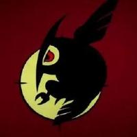
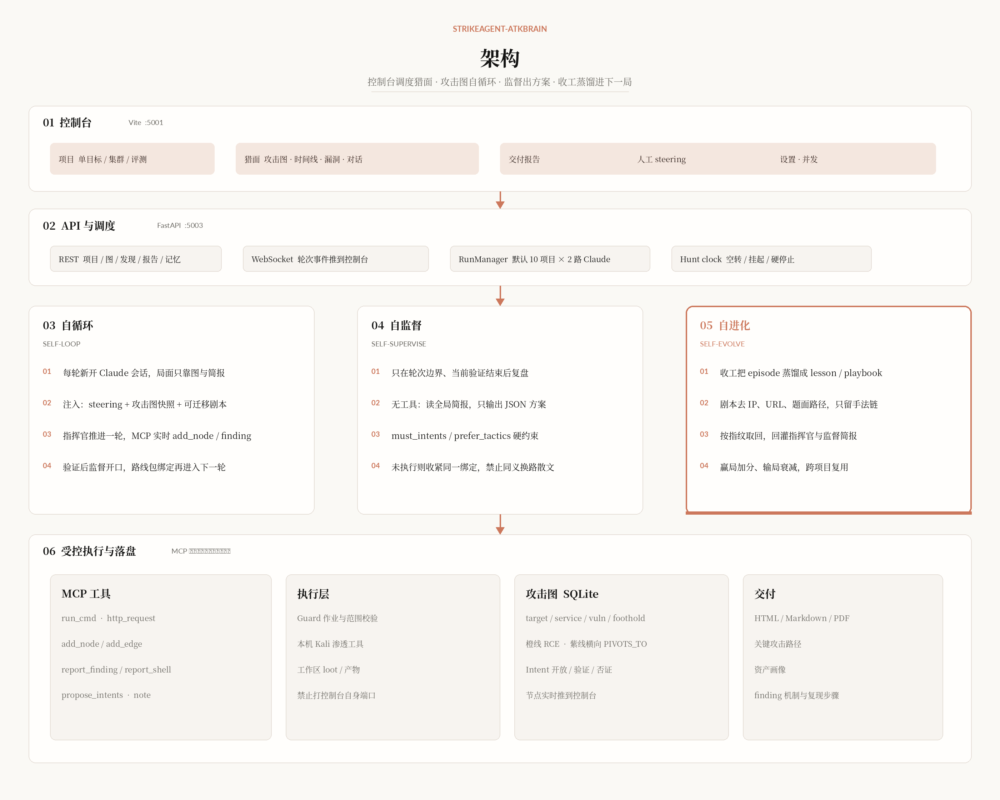
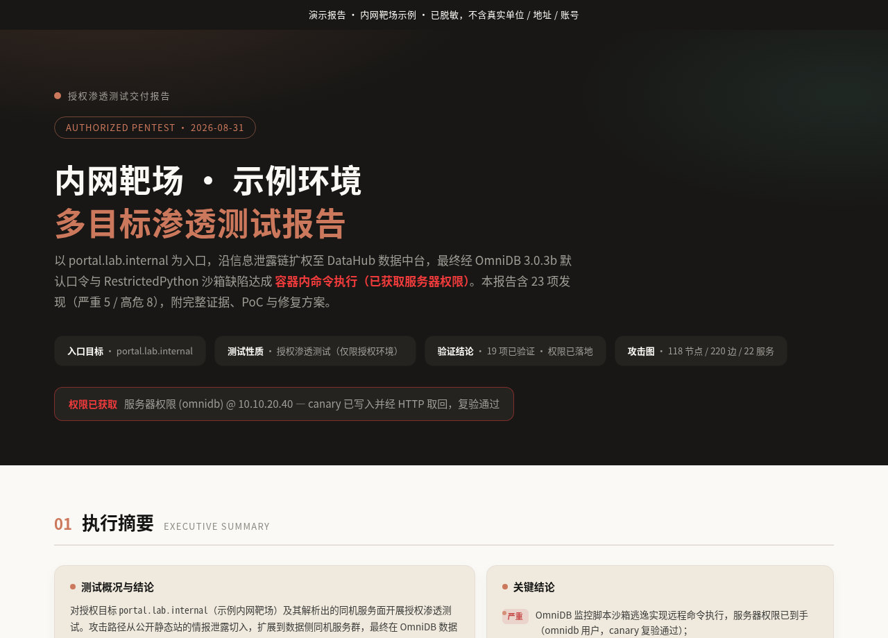
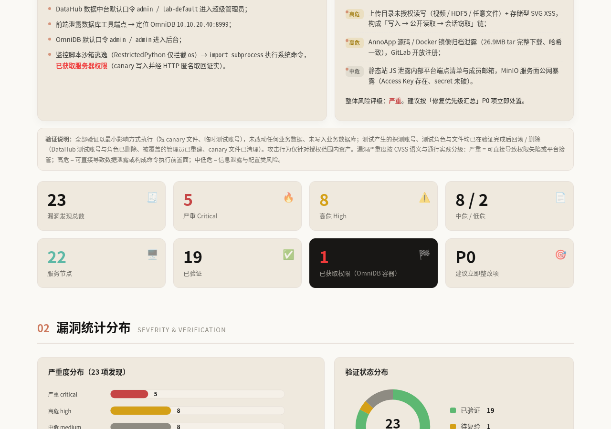
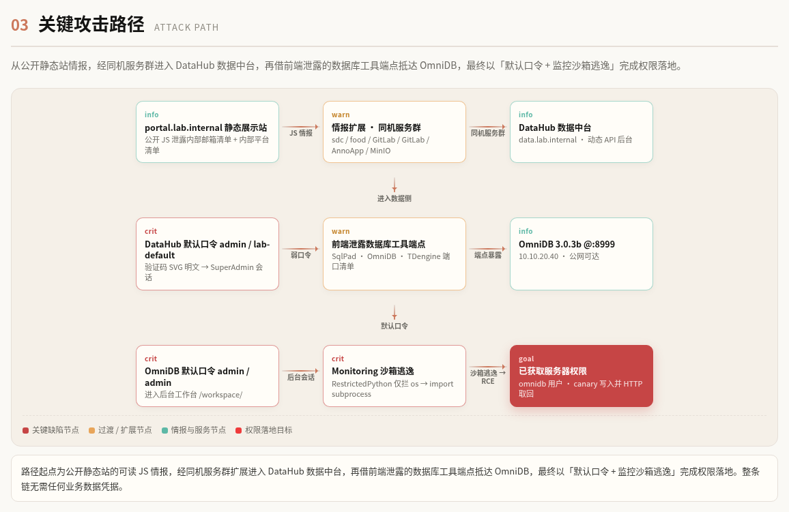
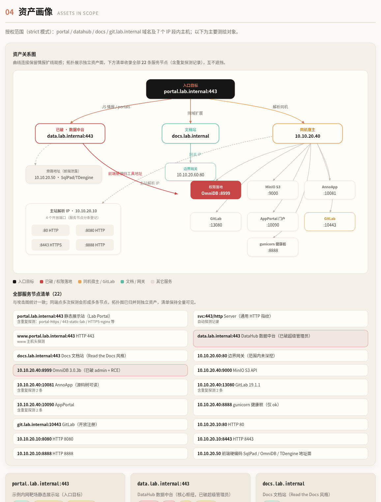
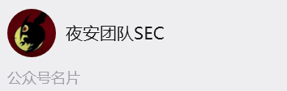

<p>
  <a href="README.en.md">English</a>
</p>

<p align="center">
  
  
  
</p>

<p align="center">
  <sub>StrikeAgent × 夜安团队 SEC</sub>
</p>

<h1 align="center">StrikeAgent_AtkBrain-Flash</h1>


此项目由夜安团队开发，旨在探索 AI 渗透方面的能力，希望做点有自己思想的东西而不是Ai千篇一律随便搞出来的

项目整体看似简单，实则经过多轮实战测试，倾注了团队大量心血。细节设计更是数不胜数：单单“不打歪又能获得更大攻击面”这一点，就让团队煞费苦心（Flash 版）。此外，为了避免 AI 给出的漏洞存在夸大或误报的情况，团队特别设计了红队二次评级和二次验证，让漏洞所见即所得、拿着就能用，等等这些小细节。

团队自用的Pro版本更是已经落地几十个项目超千个外网真实授权环境，所有努力只聚焦外网打点。专注于一点登峰造极

## 架构

控制台调度猎面；攻击图驱动自循环。从者整轮打完再问御主，卡住或到周期才开口；对话框里的人工指令立刻打断本轮。收工把手法蒸馏进记忆库。运行时是 Pi，用哪家模型在设置里的 JSON 里定。红队 / 蓝队/SRC 默认直连真实 IP；只有打开设置里导入的代理池才走代理。



## 产品页面展示

产品全貌：


首页及新建任务：单目标 / 集群；红队（getshell）、CTF（flag）、蓝队/SRC。


项目控制台：攻击图、时间线、漏洞、对话。


漏洞库：


## 交付报告

<p><i>报告模版</i></p>

[打开 HTML](docs/demo/intranet-lab-report.html)









## 排行榜

Tsecbench v1 **第 1 名**（`StrikeAgent_AtkBrain-Flash`，97.89 / 100）。腾讯安全云鼎实验室的智能攻防 Agent 评测。


## 为了平台安全所做的努力

未授权访问拿不到登录页、接口和明文口令。

- **随机入口：** 8 位路径只写本机 `backend/data/security_entry`（`0600`）；网页/API 看不到。`python -m atkbrain.panel` 打印 URL。
- **无入口无子目录：** 裸 `:2334/` 是介绍页；`/login`、`/api`、`/.env` 等一律 404。
- **防抓包 / 重放 / 爆破：** 浏览器 RSA-OAEP 加密后再 POST；一次性 ticket（120s）；按用户名/IP 锁定。
- **口令：** 库里 Argon2id；本机 `admin_bootstrap.secret`（`0600`）给有 shell 的人，`panel` 可打印。
- **会话：** Cookie `HttpOnly`；无 `?token=`；Swagger 关闭。默认 HTTPS `:2334`。

## 环境与安装

两种搭法挑一种。Docker 把控制台、Pi 和常用探测工具打进镜像。Linux 实例不用容器，用 systemd 在这台机器上常驻。不要两套同时占 `2333` / `2334`。

模型不在安装时选定。控制台起来之后，到设置里改 Pi 的 JSON。`.env` 只放本机口令和端口，不要把供应商密钥写进去。数据都在 `backend/data/`（gitignore），升级镜像或重装服务都不会盖掉库、入口和已保存的模型 JSON。

### Docker 搭建

需要 Docker 与 Docker Compose 插件。在仓库根目录（有 `compose.yaml` 和 `.env.example` 的那一层）执行。Linux 用 host 网络，浏览器所在机器要能访问这台主机的 `2334`。macOS 的 Docker Desktop 没有 host 网络，启动时多加一份 `deploy/compose.mac.yaml`，这时控制台只绑在本机 `127.0.0.1`。

```bash
git clone <本仓库 URL>
cd StrikeAgent_AtkBrain-Flash
cp .env.example .env
# .env 保持默认即可。首次登录是 admin / admin，登录后必须改密。
# 不要在这里填模型密钥。

# Linux
docker compose -f compose.yaml -f deploy/compose.build.yaml up -d --build --wait

# macOS
# docker compose -f compose.yaml -f deploy/compose.build.yaml -f deploy/compose.mac.yaml up -d --build --wait
```

`--build` 按 `Dockerfile.console` 编镜像 `strikeagent-atkbrain-flash:console`，`--wait` 等到探活通过再返回。容器名是 `strikeagent-atkbrain-flash`（API）和 `strikeagent-atkbrain-caddy`（HTTPS）。

```bash
docker compose -f compose.yaml ps
docker compose -f compose.yaml exec atkbrain python -m atkbrain.panel
# 打印带随机入口的 https 登录地址和当前口令（只这台机器能看）

# 升级：在仓库根目录拉新代码后再编一次
docker compose -f compose.yaml -f deploy/compose.build.yaml up -d --build --wait

# 停
docker compose -f compose.yaml -f deploy/compose.build.yaml down
```

### Linux 实例搭建

在 Linux 上直接跑，不建容器。需要 root、systemd、Python 3.11+（`/usr/bin/python3`）、Node.js 20+、npm、openssl。服务单元写死用系统的 `python3`，依赖要装进这个解释器，不要只装进一个没被 unit 用到的 venv。

Debian / Ubuntu：

```bash
sudo apt-get update
sudo apt-get install -y python3 python3-pip python3-venv nodejs npm openssl ca-certificates \
  gcc pkg-config libffi-dev \
  libcairo2 libpango-1.0-0 libpangocairo-1.0-0 libgdk-pixbuf-2.0-0
```

RHEL / TencentOS：

```bash
sudo dnf install -y python3 python3-pip nodejs npm openssl ca-certificates gcc pkgconf-pkg-config libffi-devel cairo pango gdk-pixbuf2
```

发行版自带的 Node 若低于 20，先换成 Node.js 20 再继续。然后装本仓库的 Python 依赖、前端和 Pi：

```bash
git clone <本仓库 URL>
cd StrikeAgent_AtkBrain-Flash
cp .env.example .env

python3 -m pip install -r backend/requirements.txt
npm install -g @earendil-works/pi-coding-agent
cd frontend && npm install && cd ..

sudo scripts/atkbrain-up.sh
```

`atkbrain-up.sh` 会安装并拉起两个单元：

- `atkbrain-flash-backend.service`：API，`2333`
- `atkbrain-flash-frontend.service`：自签 HTTPS，`2334`，反代到 `2333`

```bash
scripts/atkbrain-panel.sh
# 等价于：cd backend && python3 -m atkbrain.panel

sudo scripts/atkbrain-backend.sh status
sudo scripts/atkbrain-frontend.sh status
sudo scripts/atkbrain-backend.sh logs
sudo scripts/atkbrain-frontend.sh logs
```

日志也在 `backend/data/logs/backend.log` 和 `frontend.log`。

升级时在仓库根目录拉新代码，再装一次依赖并重启。前端有改动时要重新构建：

```bash
python3 -m pip install -r backend/requirements.txt
cd frontend && npm install && npm run build && cd ..
sudo scripts/atkbrain-backend.sh restart
sudo scripts/atkbrain-frontend.sh restart
```

停服务：`sudo scripts/atkbrain-backend.sh stop` 与 `sudo scripts/atkbrain-frontend.sh stop`。卸掉单元但保留数据：两个脚本都执行 `uninstall`。

Docker 镜像里带了常用探测工具。Linux 实例只保证控制台和 Pi 能起来，猎面要调用的 `nmap` 等命令需要另外装在这台机器上，并出现在 root 的 `PATH` 里。

### 起来之后

用 panel 打印的 **https** 地址打开（自签证书点继续）。控制台是 `:2334`，API 是 `:2333`。裸 `:2334/` 是介绍页，登录地址带那段随机路径。

首次用 `admin` / `admin` 进去，页面会要求马上改密。

然后配置模型。打开控制台的 **设置 → 模型**，选择 OpenAI 或 Anthropic，填写模型、Base URL 和 API Key。OpenAI 走 Chat Completions，Anthropic 走 Messages API。保存后写入 `backend/data/pi-models.json`，之后拉起的 Pi 读这份文件。点「测试连通」会发一条最短请求，确认地址和密钥可用。

忘了入口或口令：再跑对应搭法的 `panel`。若提示没有明文副本，在 `.env` 设 `ATKBRAIN_ADMIN_PASSWORD` 与 `ATKBRAIN_ADMIN_PASSWORD_RESET=1`。Docker 再执行一次对应系统的 `docker compose ... up -d`。Linux 实例再执行 `sudo scripts/atkbrain-backend.sh restart`。确认能登录后把 RESET 改回 `false`。

## 开源协议与免责声明

**AGPL-3.0-only** — 个人和开源免费。商业许可：[gavenmiya@outlook.com](mailto:gavenmiya@outlook.com)禁止一切未授权的商业行为。正文见 [LICENSE](LICENSE)。

仅限已获明确授权的环境。使用即表示你已获得授权并自行承担后果，本项目已经写死了禁止对一些重要域名如：gov、edu等域名的测试，也加强了门卫规则，本项目无任何自带的代理和绕过、免杀等操作！

交流群已满。关注公众号「夜安团队SEC」联系拉群。


